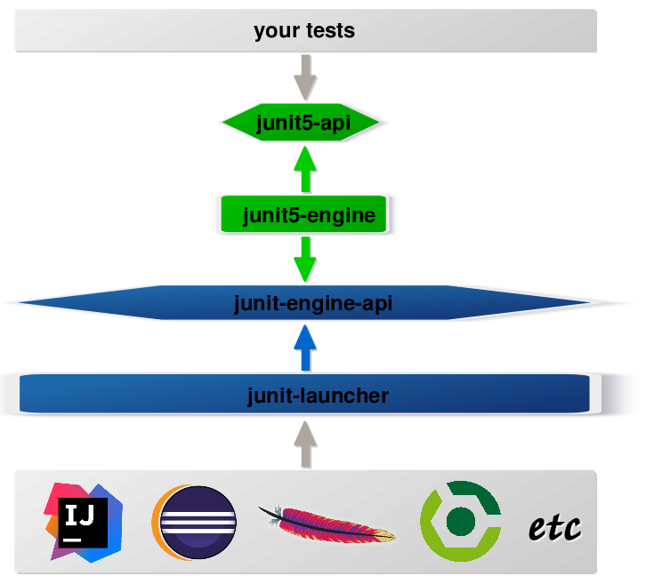
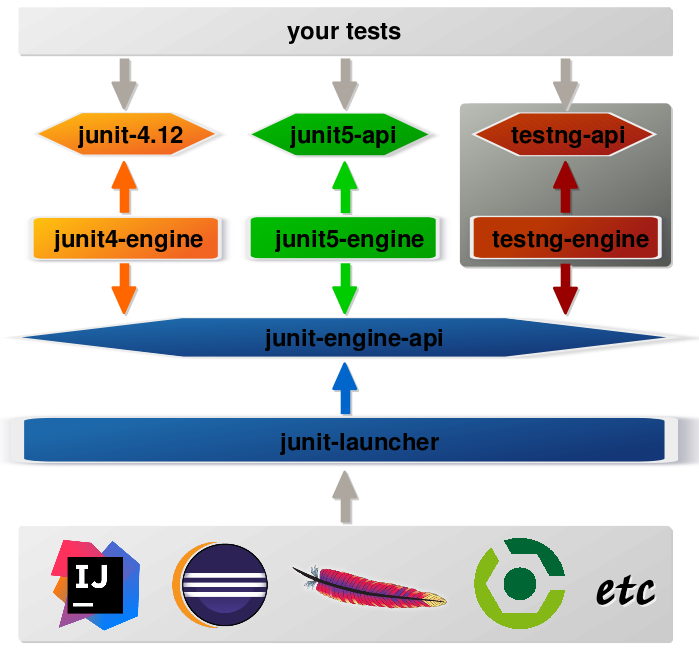

= JUnit 5
:backend: revealjs
:revealjs_center: true
:revealjs_theme: nipa-night
:revealjs_controls: false
:revealjs_history: true
:revealjs_progress: false
:revealjs_transition: slide
:revealjs_backgroundTransition: fade
:revealjs_parallaxBackgroundImage: images/soap-bubbles.jpg
:revealjs_parallaxBackgroundSize: 4096px 2731px

++++
<h2>Next Generation Testing<br>on the JVM</h2>
<div class="event">
	<div class="participant">
		
		<div class="name">
			<p>Nicolai Parlog</p>
			<p><a href="http://codefx.org">codefx.org</a>
				/ <a href="https://twitter.com/nipafx" title="Nicolai on Twitter">@nipafx</a></p>
		</div>
	</div>
	<div class="participant">
		
		<div class="name">
			<p><a href="http://jeeconf.com/">JEEConf</a></p>
			<p><a href="https://twitter.com/jeeconf" title="JEEConf on Twitter">@jeeconf</a></p>
		</div>
	</div>
</div>
++++

++++
<link rel="stylesheet" href="highlight.js/9.2.0.monokai-sublime.css">
<script src="highlight.js/9.2.0.min.js"></script>
<script>
	hljs.initHighlightingOnLoad();
	hljs.configure({tabReplace: '    '})
</script>
++++

// Just adding a footer does not work because reveal.js puts it into the slides
// and we couldn't get it out via CSS. So we move it via JavaScript.
++++
<footer>
	<div class="participant">
		
		<div class="name"><p>
			Nicolai Parlog
			/ <a href="http://codefx.org">codefx.org</a>
			/ <a href="https://twitter.com/nipafx" title="Nicolai on Twitter">@nipafx</a>
		</div>
	</p></div>
	<div class="participant">
		
		<div class="name"><p>
			<a href="http://jeeconf.com/">JEEConf</a>
				/ <a href="https://twitter.com/jeeconf" title="JEEConf on Twitter">@jeeconf</a>
		</p></div>
	</div>
</footer>
<script>
	document.addEventListener('DOMContentLoaded', function () {
		document.body.appendChild(document.querySelector('footer'));
	})
</script>
++++


// ############### //
// H E A D S   U P //
// ############### //

== Heads Up

JUnit 5 is work in progress!

This is based on the alpha version +
(released in February 2016).

Some Links: +
https://github.com/junit-team/junit5[source] /
http://junit.org/junit5/docs/current/user-guide[user guide] /
https://twitter.com/junitteam[@junitteam] +
http://blog.codefx.org/tag/junit-5/[articles on my blog]

Give feedback!


// ########### //
// B A S I C S //
// ########### //


[data-state="no-title"]
== Basics

++++
<table class="toc">
	<tr class="toc-current"><td class="tg-yw4l">Basics</td></tr>
	<tr><td class="tg-yw4l">Extensions</td></tr>
	<tr><td class="tg-yw4l">Architecture</td></tr>
	<tr><td class="tg-yw4l">Tools &amp; Setup</td></tr>
</table>
++++

=== What's New?

```java
class JUnit5Test {

	@Test
	void someTest() {
		assertTrue(true);
	}

}
```

++++
<p class="fragment current-visible">⇝ Package visibility suffices!</p>
++++

=== What's New?

```java
@BeforeAll
static void beforeAll() { ... }

@BeforeEach
void beforeEach() { ... }

@AfterEach
void adterEach() { ... }

@AfterAll
static void afterAll() { ... }
```

++++
<p class="fragment current-visible">⇝ Lifecycle annotations have new names.</p>
++++

=== What's New?

```java
@Test
@Disabled("Y U No Pass?!")
void failingTest() {
	assertTrue(false);
}
```

++++
<p class="fragment current-visible">⇝ <code>@Ignored</code> is now <code>@Disabled</code>.</p>
++++

=== What's New?

```java
@Test
@DisabledOnFriday
void failingTest() {
	assertTrue(false);
}
```

++++
<p class="fragment current-visible" data-fragment-index="0">⇝ Convenient Extensibility.</p>
<p class="fragment current-visible" data-fragment-index="1">But how?</p>
++++

=== What's New?

```java
@Test
void someTest() {
	...
	assertEquals(
		expected,
		actual,
		"Should be equal.");
}
```

++++
<p class="fragment current-visible">⇝ Failure message comes last.</p>
++++

=== What's New?

```java
@Test
void someTest() {
	...
	assertEquals(
		expected,
		actual,
		() -> "Should " + "be " + "equal.");
}
```

++++
<p class="fragment current-visible">⇝ Failure message can be created lazily.</p>
++++

=== What's New?

```java
@Test
void assertAllProperties() {
	Address ad = new Address(
	  "City", "Street", "42");

	assertAll("address",
	  () -> assertEquals("C", ad.city),
	  () -> assertEquals("Str", ad.street),
	  () -> assertEquals("63", ad.number)
	);
}
```

++++
<p class="fragment current-visible">⇝ <code>assertAll</code> gathers results from multiple assertions</p>
++++

=== What's New?

Output if `assertAll` fails:

```bash
org.opentest4j.MultipleFailuresError:
	address (3 failures)
	expected: <C> but was: <City>
	expected: <Str> but was: <Street>
	expected: <63> but was: <42>
```


=== What's New?

```java
void throwing() {
	throws new IllegalStateException();
}

@Test
void assertExceptions() {
	assertThrows(
		Exception.class,
		this::throwing);
}
```

++++
<p class="fragment current-visible">⇝ <code>assertThrows</code> asserts that<br>
	an exception of a specific type was thrown</p>
++++

=== What's New?

```java
@Test
void assertExceptions() {
	Exception ex = expectThrows(
		Exception.class,
		this::throwing);
	assertEquals("Msg", ex.getMessage());
}
```

++++
<p class="fragment current-visible">⇝ <code>expectThrows</code> is like <code>assertThrows</code><br>
	but also returns the exception for further examination</p>
++++

=== What's New?

```java
class CountTest {
	// lifecycle and tests
	@Nested
	class CountGreaterZero {
		// lifecycle and tests
		@Nested
		class CountMuchGreaterZero {
			// lifecycle and tests
		}
	}
}
```

++++
<p class="fragment current-visible">⇝ <code>@Nested</code> to organize tests in inner classes</p>
++++

=== What's New?

```java
@DisplayName("A count")
class CountTest {
	@Nested
	@DisplayName("when greater zero")
	class CountGreaterZero {
		@Test
		@DisplayName("is positive")
		void isPositive() { ... }
	}
}
```

++++
<p class="fragment current-visible">⇝ <code>@DisplayName</code> to show a nice name</p>
++++

=== What's new?

The effects of `@DisplayName`:

image::images/testing-a-stack.png[]

=== What's new?

```java
@Test
void someTest(MyServer server) {
	// do something with `server`
}
```

++++
<div class="fragment current-visible">
	<p>⇝ Parameter Injection!</p>
	<p>But where does it come from?</p>
</div>
++++

=== What's New?

++++
<h3>Summary</h3>
++++

* lifecycle works much like before
* many details were improved
* `@Nested` & `DisplayName` +
make a nice couple
* parameter injection
* no lambdas (so far)

++++
<p class="fragment current-visible">
That's all very nice but how is it<br>
<i>Next Generation Testing</i>?
</p>
++++


// ################### //
// E X T E N S I O N S //
// ################### //


[data-state="no-title"]
== Extensions

++++
<table class="toc">
	<tr><td class="tg-yw4l">Basics</td></tr>
	<tr class="toc-current"><td class="tg-yw4l">Extensions</td></tr>
	<tr><td class="tg-yw4l">Architecture</td></tr>
	<tr><td class="tg-yw4l">Tools &amp; Setup</td></tr>
</table>
++++


=== Extensions in JUnit 4

++++
<h3>Runners</h3>
++++

Manage a test's full lifecycle.

```java
@RunWith(MockitoJUnitRunner.class)
public class MyTest { ... }
```

* very flexible
* heavyweight
* exclusive


=== Extensions in JUnit 4

++++
<h3>Rules</h3>
++++

Execute code before and after statements.

```java
public class MyTest {
	@Rule
	public MockitoRule rule =
		MockitoJUnit.rule();
}
```

* added in 4.7
* lightweight
* limited to before/after behavior


=== Extensions in JUnit 4

Extension model is not optimal:

* two competing mechanisms
** each with limitations
** but with considerable overlap
* composition can cause problems


=== Approach in JUnit 5

From JUnit 5's
https://github.com/junit-team/junit5/wiki/Core-Principles[Core Principles]:

> Prefer extension points over features

Quite literally JUnit 5 has _Extension Points_


=== Extension Points

// TODO consider creating a table that shows "JUnit steps" on the left and extension points on the right

* BeforeAll Callback
* Test Instance Post Processing
* Conditional Test Execution
* BeforeEach Callback
* Parameter Resolution
* Exception Handling
* AfterEach Callback
* AfterAll Callback


=== Implementing Extensions

* one interface for each extension point
* method arguments capture context

```java
public interface BeforeEachExtensionPoint
		extends ExtensionPoint {

	void beforeEach(
		TestExtensionContext context)
		throws Exception;
}
```

* an extension can use multiple points +
to implement its feature


=== Benchmark Extension

We want to benchmark our tests!

* for each test method
* write the runtime to console

How?

* store test launch time _before each_ test
* compute runtime and print _after each_ test


=== Benchmark Extension

```java
public class BenchmarkExtension implements
		BeforeEachExtensionPoint,
		AfterEachExtensionPoint {

	private long launchTime;

	// ...
}
```


=== Benchmark Extension

```java
@Override
public void beforeEach(
		TestExtensionContext context) {
	launchTime = currentTimeMillis();
}

@Override
public void afterEach(
		TestExtensionContext context) {
	printf("Test '%s' took %d ms.%n",
		context.getDisplayName(),
		currentTimeMillis() - launchTime);
}
```


=== Other Examples

Remember This?

```java
@Test
@DisabledOnFriday
void failingTest() {
	assertTrue(false);
}
```

Let's see how it works!


=== Disabled Extension

```java
public class DisabledOnFridayCondition
		implements TestExecutionCondition {
	@Override
	public ConditionEvaluationResult evaluate(
			TestExtensionContext context) {
		if (isFriday())
			return disabled("Happy Weekend!");
		else
			return enabled("Fix it!");
	}
}
```


=== Other Examples

What about parameter injection?

```java
@Test
void someTest(MyServer server) {
	// do something with `server`
}
```


=== Parameter Injection

```java
public class MyServerParameterResolver
		implements MethodParameterResolver {
	@Override
	public boolean supports(
			Parameter parameter, ... ) {
		return parameter.getType()
				== MyServer.class;
	}
	@Override
	public Object resolve( ... ) {
		return new MyServer();
	}
}
```


=== Applying Extensions

How do we apply extensions?

```java
@ExtendWith(DisabledOnFridayCondition.class)
class JUnit5Test {
	...
}
```

That's technical and verbose... :(


=== Applying Extensions

https://en.wikibooks.org/wiki/Java_Programming/Annotations/Meta-Annotations[Meta-annotations] to the rescue!

* JUnit 5's annotations are meta-annotations
* JUnit 5 checks recursively for annotations
* ⇝ we can create our own annotations!


=== Creating Annotations

```java
@ExtendWith(DisabledOnFridayCondition.class)
public @interface DisabledOnFriday { }

@Test
@Tag("integration")
@ExtendWith(BenchmarkExtension.class)
@ExtendWith(MyServerParameterResolver.class)
public @interface IntegrationTest { }

@IntegrationTest
@DisabledOnFriday
void testLogin(MyServer server) { ... }
```


=== Extensions

++++
<h3>Summary</h3>
++++

* flexibility due to many points
* extensions compose well
* customizable due to meta-annotations

(We left out some details;
http://blog.codefx.org/design/architecture/junit-5-extension-model/[read more])

++++
<p class="fragment current-visible">
That's all very nice but how is it<br>
<i>Next Generation Testing</i>?
</p>
++++


// ####################### //
// A R C H I T E C T U R E //
// ####################### //


[data-state="no-title"]
== Architecture

++++
<table class="toc">
	<tr><td class="tg-yw4l">Basics</td></tr>
	<tr><td class="tg-yw4l">Extensions</td></tr>
	<tr class="toc-current"><td class="tg-yw4l">Architecture</td></tr>
	<tr><td class="tg-yw4l">Tools &amp; Setup</td></tr>
</table>
++++


=== JUnit 4 Architecture

* a single JAR (ignoring Hamcrest)
* used by
** developers
** extensions
** IDEs, build-tools
* no separation of concerns


=== JUnit 4 Architecture

* tools provide us with awesome features!
* but API is not powerful enough

++++
<div class="fragment current-visible">
<div class="quoteblock"><blockquote><div class="paragraph"><p>I know, I’ll use reflection!</p></div></blockquote></div>
<div class="ulist"><ul>
	<li><p>nothing was safe!</p></li>
	<li><p>bound tools to implementation details</p></li>
	<li><p>made maintenance and evolution very hard</p></li>
</ul></div>
</div>
++++


=== Dead End

Part of JUnit's success it its great tool support!

But the same tools locked development in.

> The success of JUnit as a platform prevents the development of JUnit as a tool. +
(https://jaxenter.com/crowdfunding-for-junit-lambda-is-underway-119546.html[Johannes Link])


=== Approach in JUnit 5

Separation of concerns:

. an API to write tests against
. a mechanism to discover and run tests


=== Looking Closer

++++
<div class="conversation">
<p class="left">An API to write test against.</p>
<p class="right">Ok.</p>
<p class="left">A mechanism to discover and run tests.</p>
<p class="right">Which tests?</p>
<p class="left">JUnit (obviously!)</p>
<p class="right">But which version?</p>
<p class="left">Eh, 5?</p>
<p class="right">Just lame old @Test-annotated?</p>
<p class="left">Err...</p>
<p class="right">No extension for lambdas?!</p>
<p class="left">Ok, ok!</p>
</div>
++++


=== Approach in JUnit 5

Separation of concerns V 2.0:

. an API to write tests against
. a mechanism to discover and run tests
[loweralpha]
.. specific mechanism per variant of tests +
(e.g. JUnit 4 or JUnit 5)
.. orchestration of specific mechanisms
.. API between them


=== JUnit 5 Modules

`junit5-api` ::
	the API for us to write tests against
`junit-enginge-api` ::
	the API all test engines have to implement
`junit5-engine` ::
	implementation for JUnit 5 tests
`junit-launcher` ::
* discovers test engines
* orchestrates their execution
* provides an API to IDEs and build tools


=== JUnit 5 Modules




=== Architecture

++++
<h3>Summary</h3>
++++

* clear separation of concerns
* API for developers
* API for tools

++++
<p class="fragment" data-fragment-index="0">
That's all very nice but how is it<br>
<i>Next Generation Testing</i>?
</p>

<p class="fragment" data-fragment-index="1">
<strong>Because it opens up the platform!</strong>
</p>
++++


=== Moar Engines!

* want to run JUnit 4 tests? +
⇝ create an engine for it
* want TestNG to have support like JUnit? +
⇝ create an engine for it
* want to write tests as lambdas? +
⇝ create an engine for it


=== Moar Engines!




=== Open Platform

Once JUnit 5 adoption sets in:

* tools are decoupled from implementation details
* tools can support all test frameworks equally well
* new frameworks start with full tool support
* developers can try out new things

A new generation of test frameworks might arise!


=== Open Platform

JUnit's success as a platform +
becomes *available to everybody*.

This might herald the +
*next generation of testing on the JVM*!


=== Architecture

++++
<h3>Summary</h3>
++++

* clear separation of concerns: +
APIs for developers, tools, +
and new frameworks
* opens up the platform
* tool support for everybody!
