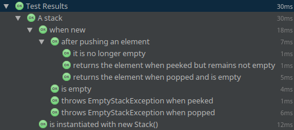

= JUnit 5
:backend: revealjs
:revealjs_center: true
:revealjs_theme: nipa-night
:revealjs_controls: false
:revealjs_history: true
:revealjs_progress: false
:revealjs_transition: slide
:revealjs_backgroundTransition: fade
:revealjs_parallaxBackgroundImage: images/soap-bubbles.jpg
:revealjs_parallaxBackgroundSize: 4096px 2731px

++++
<h2>The Future of Testing<br>on the JVM</h2>
<div class="event">
	<div class="participant">
		
		<div class="name">
			<p>Nicolai Parlog</p>
			<p><a href="http://codefx.org">codefx.org</a>
				/ <a href="https://twitter.com/nipafx" title="Nicolai on Twitter">@nipafx</a></p>
		</div>
	</div>
	<div class="participant">
		
		<div class="name">
			<p><a href="http://jeeconf.com/">JEEConf</a></p>
			<p><a href="https://twitter.com/jeeconf" title="JEEConf on Twitter">@jeeconf</a></p>
		</div>
	</div>
</div>
++++

++++
<link rel="stylesheet" href="highlight.js/9.2.0.monokai-sublime.css">
<script src="highlight.js/9.2.0.min.js"></script>
<script>
	hljs.initHighlightingOnLoad();
	hljs.configure({tabReplace: '    '})
</script>
++++

// Just adding a footer does not work because reveal.js puts it into the slides
// and we couldn't get it out via CSS. So we move it via JavaScript.
++++
<footer>
	<div class="participant">
		
		<div class="name"><p>
			Nicolai Parlog
			/ <a href="http://codefx.org">codefx.org</a>
			/ <a href="https://twitter.com/nipafx" title="Nicolai on Twitter">@nipafx</a>
		</div>
	</p></div>
	<div class="participant">
		
		<div class="name"><p>
			<a href="http://jeeconf.com/">JEEConf</a>
				/ <a href="https://twitter.com/jeeconf" title="JEEConf on Twitter">@jeeconf</a>
		</p></div>
	</div>
</footer>
<script>
	document.addEventListener('DOMContentLoaded', function () {
		document.body.appendChild(document.querySelector('footer'));
	})
</script>
++++


// ########### //
// B A S I C S //
// ########### //


== !

++++
<table class="toc">
	<tr class="toc-current"><td class="tg-yw4l">Basics</td></tr>
	<tr><td class="tg-yw4l">Extensions</td></tr>
	<tr><td class="tg-yw4l">Architecture</td></tr>
	<tr><td class="tg-yw4l">Tools &amp; Setup</td></tr>
</table>
++++

=== What's New?

```java
class Lifecycle {

	@Test
	void someTest() {
		assertTrue(true);
	}

}
```

++++
<p class="fragment current-visible">⇝ Package visibility suffices!</p>
++++

=== What's New?

```java
@BeforeAll
static void beforeAll() { ... }

@BeforeEach
void beforeEach() { ... }

@AfterEach
void adterEach() { ... }

@AfterAll
static void afterAll() { ... }
```

++++
<p class="fragment current-visible">⇝ Lifecycle annotations have new names.</p>
++++

=== What's New?

```java
@Test
@Disabled("Y U No Pass?!")
void failingTest() {
	assertTrue(false);
}
```

++++
<p class="fragment current-visible">⇝ <code>@Ignored</code> is now <code>@Disabled</code>.</p>
++++

=== What's New?

```java
@Test
@DisabledOnFridayAfternoon
void failingTest() {
	assertTrue(false);
}
```

++++
<p class="fragment current-visible" data-fragment-index="1">⇝ Convenient Extensibility.</p>
<p class="fragment current-visible" data-fragment-index="1">But how?</p>
++++

=== What's New?

```java
@Test
void someTest() {
	...
	assertEquals(
		expected,
		actual,
		"Should be equal.");
}
```

++++
<p class="fragment current-visible">⇝ Failure message comes last.</p>
++++

=== What's New?

```java
@Test
void someTest() {
	...
	assertEquals(
		expected,
		actual,
		() -> "Should " + "be " + "equal.");
}
```

++++
<p class="fragment current-visible">⇝ Failure message can be created lazily.</p>
++++

=== What's New?

```java
@Test
void assertAllProperties() {
	Address ad = new Address(
	  "City", "Street", "42");

	assertAll("address",
	  () -> assertEquals("C", ad.city),
	  () -> assertEquals("Str", ad.street),
	  () -> assertEquals("63", ad.number)
	);
}
```

++++
<p class="fragment current-visible">⇝ <code>assertAll</code> gathers results from multiple assertions</p>
++++

=== What's New?

Output if `assertAll` fails:

```bash
org.opentest4j.MultipleFailuresError:
    address (3 failures)
	expected: <C> but was: <City>
	expected: <Str> but was: <Street>
	expected: <63> but was: <42>
```


=== What's New?

```java
void throwing() {
	throws new IllegalStateException();
}

@Test
void assertExceptions() {
	assertThrows(
		Exception.class,
		this::throwing);
}
```

++++
<p class="fragment current-visible">⇝ <code>assertThrows</code> asserts that<br>
	an exception of a specific type was thrown</p>
++++

=== What's New?

```java
@Test
void assertExceptions() {
	Exception ex = expectThrows(
		Exception.class,
		this::throwing);
	assertEquals("Msg", ex.getMessage());
}
```

++++
<p class="fragment current-visible">⇝ <code>expectThrows</code> is like <code>assertThrows</code><br>
	but also returns the exception for further examination</p>
++++

=== What's New?

```java
class CountTest {
	// lifecycle and tests
	@Nested
	class CountGreaterZero {
		// lifecycle and tests
		@Nested
		class CountMuchGreaterZero {
			// lifecycle and tests
		}
	}
}
```

++++
<p class="fragment current-visible">⇝ <code>@Nested</code> to organize tests in inner classes</p>
++++

=== What's New?

```java
@DisplayName("A count")
class CountTest {
	@Nested
	@DisplayName("when greater zero")
	class CountGreaterZero {
		@Test
		@DisplayName("is positive")
		void isPositive() { ... }
	}
}
```

++++
<p class="fragment current-visible">⇝ <code>@DisplayName</code> to show a nice name</p>
++++

=== What's new?

The effects of `@DisplayName`:



=== What's new?

```java
@Test
void someTest(MySpecialServer server) {
	// do something with `server`
}
```

++++
<div class="fragment current-visible">
	<p>⇝ Parameter Injection!</p>
	<p>But where does it come from?</p>
</div>
++++
